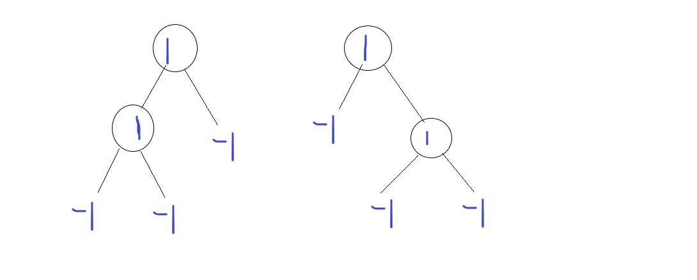

## dsa-cheat-sheet - Misscxx

## **Heap**
1. Heap is Formed from Full Binary Tree i.e complete till level h-1 and then filled form left to right at level h
2. At any index i in array, it's child is 2*i and (2*i+1) and parent is floor(i/2).
3. Time taken to insert value in Heap in O(log(N)) i.e O(log(height of Tree)) and in worst case element may be leaf node i.e hight = log(n).
4. Priority Queue in C++ in example of heap.

## **Binary Tree**
1. If we need to showcase end of nodes then we can make a -1 node at the end of each leaf which would help in some questions,https://leetcode.com/problems/same-tree/


Code for that is, this would give the vector with -1 for leaf nodes.
```cpp
  void inOrder(TreeNode* root, vector<int> &v){
        if(root){
            inOrder(root->left,v);
            v.push_back(root->val);
            inOrder(root->right,v);
        }
        v.push_back(-1);
    }
```
One More Better way to traverse the two trees is.
Here we traverse both the trees together, first Right Subtree in both trees and then left subtree in both the trees.
```cpp
  bool isSameTree(struct TreeNode* p, struct TreeNode* q){
    if(!p && !q) return true;
    if((!p && q) || (p && !q)) return false;
    return (p->val && q->val) && isSameTree(p->left,q->left) && isSameTree(p->right,q->right); 
}

```
One Similar Problem is Symmetric tree: https://leetcode.com/problems/symmetric-tree/

2. Returning from Traversal Methods

 


```py
class Solution:
    def maxDepth(self, root: Optional[TreeNode]) -> int:
        presentDepth = 1
        maxDepth = 0
        return self.inOrder(root, presentDepth, maxDepth)
    
    def inOrder(self, root, presentDepth, maxDepth):
        if(root):
            maxDepth = self.inOrder(root.left, presentDepth+1,maxDepth)
            if(presentDepth > maxDepth):
                maxDepth = presentDepth
            maxDepth = self.inOrder(root.right, presentDepth+1,maxDepth)
        return maxDepth
        
```

> When left of 9 is called, it does not go inside the if block and thus return the maxDepth which was given to it while calling it. This returned maxDepth is stored in maxDepth itself i.e updated. Then we can perform any operation with that and then call the right, right also does the same thing and returns the maxDepth it received. This maxDepth is stored in maxDepth, i.e Updated Max Depth from right is now present

> Now 9'call is over and hence it finishes it's if block and now it is on it's return statement. It returns the updated maxDepth.

> Now 9 was called as the left of 3, thus maxDepth is returned at the first inOrder Call of Node 3, and this maxDepth returned by 9 is stored in maxDepth of first call. Now this is the updated maxDepth from left. Now we can do any operation related to maxDepth and then we call the right of 3 with this updated maxDepth. 

> And this process continues in right subtree and then finally we get the updated maxDepth from right and is stored in maxDepth of second inOrder Call and then call of root node 3 is over and we finally return the maxDepth


