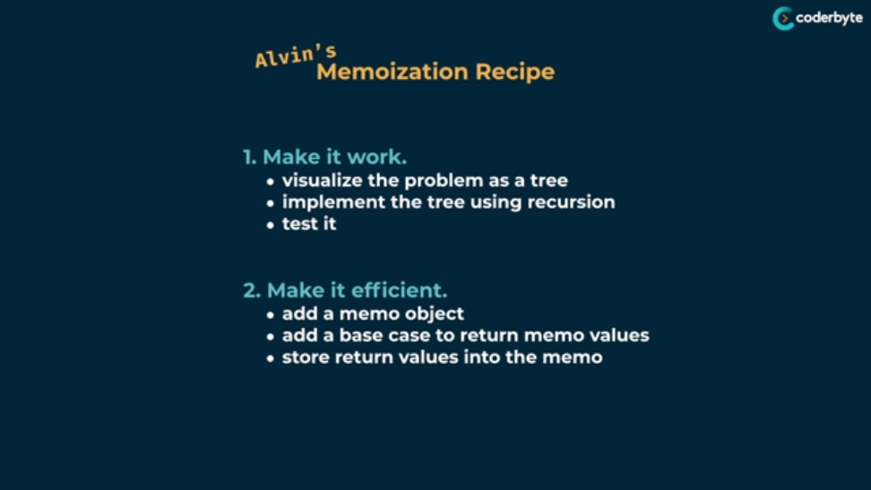
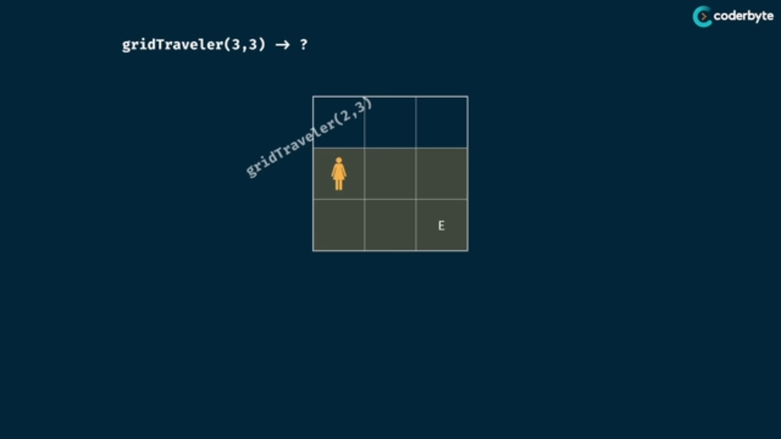
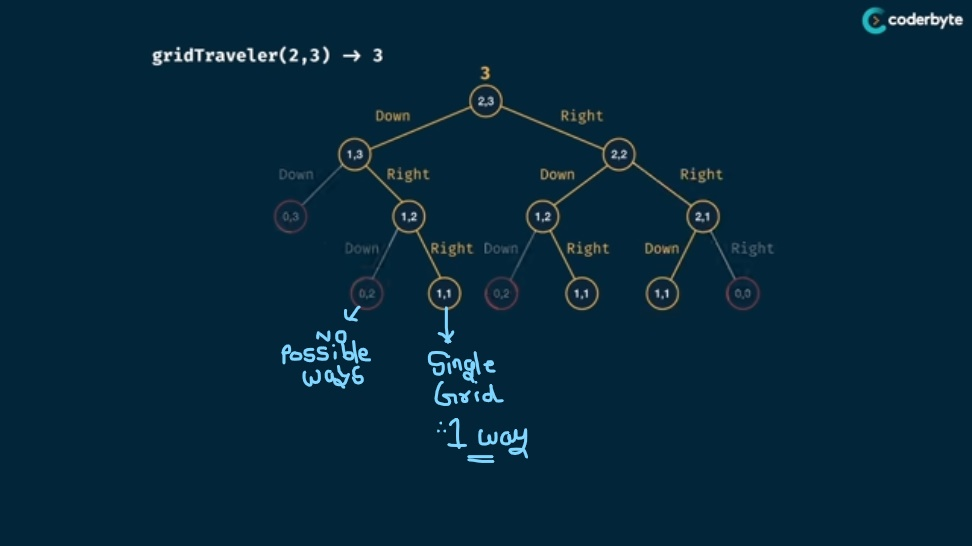
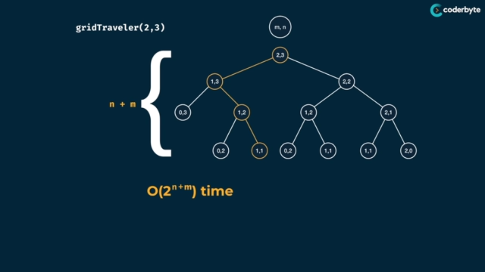
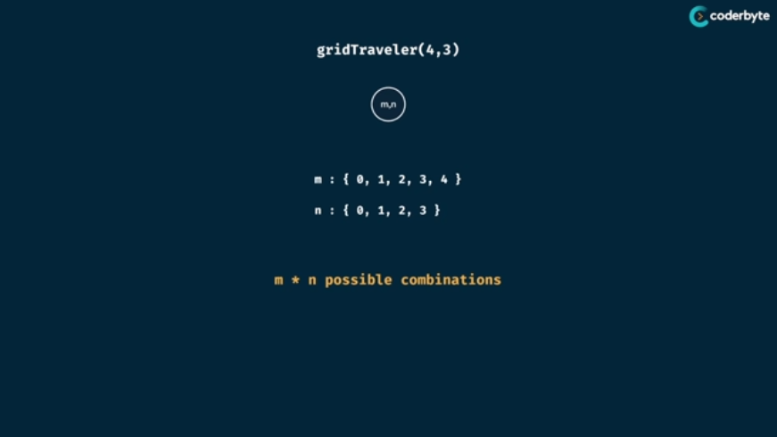
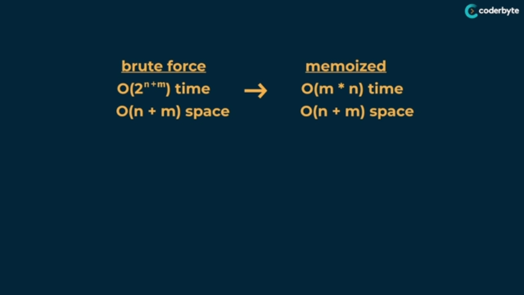

# Dynamic Programming

## Memoization Recipe

### Fibonacci

1. Time Complexity  before DP

2. Time Complexity  after DP

### Grid Traveller
> Problem and Logic

  

1. Time Complexity  Before DP

2. Time Complexity  After DP

 

