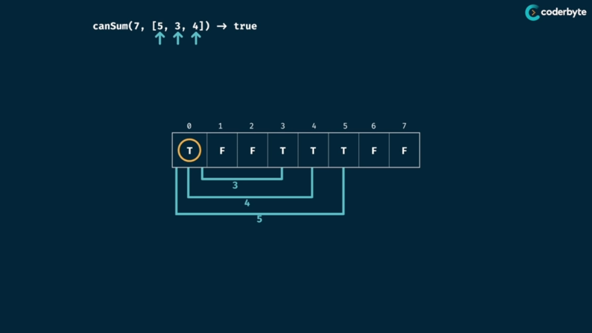

# Tabluation

### Grid Traveler Example

## Tabulation Recipe

## Can Sum Problem

1. Here, we made the table of size targetSum + 1.
2. In long run we need to return the boolean value and hence we initialize table with False.
3. Then, we can always make the Sum 0, by not selecting any thing,thus index 0 in T.
4. Now, if we can make any particular targetSum, then definitely we can also generate a targetSum by adding the available numbers.
> Eg: If we have number's array as [2,3,4] then if we can generate a number let say 6 (3 + 3) then we can also generatethe numbers:
> 
>             1) 6 + 2 => 8 ( Moving 2 places ahead in array )
> 
>             2) 6 + 3 => 9 ( Moving 3 places ahead in array )
>             
>             3) 6 + 4 => 10 ( Moving 4 places ahead in array )

