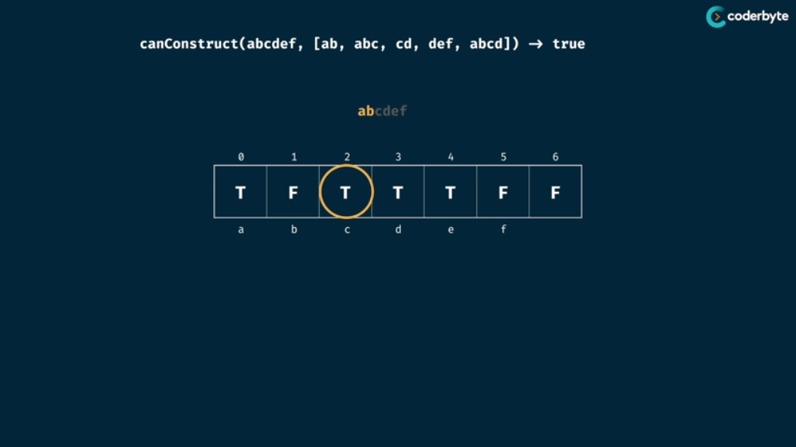

# Tabluation

### Grid Traveler Example


## Tabulation Recipe


## Can Sum Problem

1. Here, we made the table of size targetSum + 1.
2. In long run we need to return the boolean value and hence we initialize table with False.
3. Then, we can always make the Sum 0, by not selecting any thing,thus index 0 in T.
4. Now, if we can make any particular targetSum, then definitely we can also generate a targetSum by adding the available numbers.
> Eg: If we have number's array as [2,3,4] then if we can generate a number let say 6 (3 + 3) then we can also generatethe numbers:
> 
>             1) 6 + 2 => 8 ( Moving 2 places ahead in array )
> 
>             2) 6 + 3 => 9 ( Moving 3 places ahead in array )
>             
>             3) 6 + 4 => 10 ( Moving 4 places ahead in array )


## canConstruct problem

1. If we can construct the present length of string, then for remaining length of string, if any word matches any number of remaining characters then we can construct the string of that much length also. Look at the example below
> Eg: If we have words ``` abcdef ``` and we have words as ``` {"ab", "abc", "cd", "def", "abcd"} ``` then let say we have already constructed the word ab (lengt 2 ) so now remaining lenght is ``` cdef ``` this can be then checked if it can be formed form the words already present. So we see ``` cd ``` is the matching word and hence we can say that present lenght of 2 and then more length of 2 ( ``` cd ```) i.e total 4 length of word can be formed viz. ``` abcd ```


